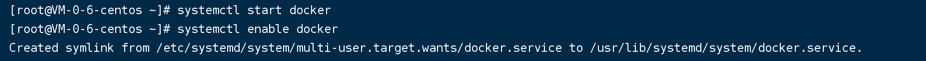

#docker部署学习之路

##1.查看内核版本
> uname -r \
> docker 要求 CentOS 系统的内核版本高于 3.10

##2.若之前安装过，则进行删除
> yum remove docker \
docker-client \
docker-client-latest \
docker-common \
docker-latest \
docker-latest-logrotate \
docker-logrotate \
docker-engine

##3.安装升级依赖包
> sudo yum update \
>yum install -y yum-utils 
device-mapper-persistent-data 
lvm2

##4.设置仓库
> yum-config-manager \
--add-repo \
https://download.docker.com/linux/centos/docker-ce.repo

##5.安装docker
> yum install docker-ce docker-ce-cli containerd.io

##6.设置开机启动
> systemctl start docker \
> systemctl enable docker

##7.验证是否安装成功
> docker version \
> docker run hello-world

##8.常用的docker命令
> docker images \
> docker pull \
> docker run 镜像名称

##9.配置阿里云镜像中心
需要先登录阿里云的控制台 \
https://homenew.console.aliyun.com/home/dashboard/Operation
> sudo mkdir -p /etc/docker
sudo tee /etc/docker/daemon.json <<-'EOF'
{
"registry-mirrors": ["https://dsds.mirror.aliyuncs.com"]
}
EOF
sudo systemctl daemon-reload
sudo systemctl restart docker

接下来部署mysql镜像就不单独赘述了